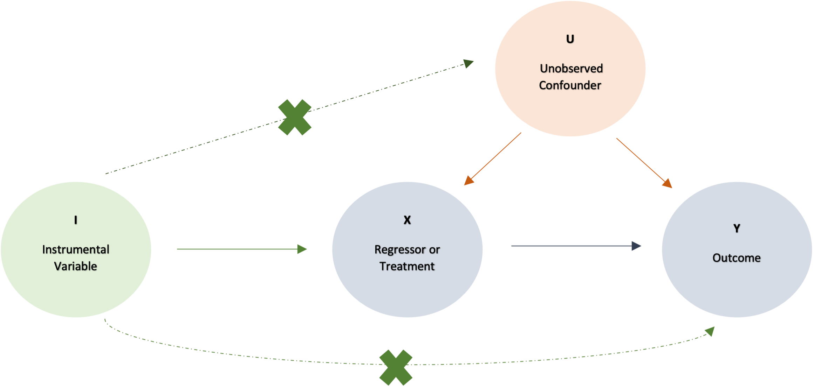

**Instrumental Variables (IV)** is one of many ways to estimate true causal effect when the treatment variable is endogenous. Endogeneity issue arises when the key regressor is correlated with error term, `$cov(x,ε)≠0$`. In other words, the endogenous variable is affected by some other variables that are also correlated with the outcome. This can happen in one or more scenarios listed below[^endo]:

*i)	The presence of an omitted variable where it correlates with both the treatment variable and the outcome variable.*

*ii)	The existence of measure error with the treatment variable `$x$`.*
	
*iii) The occurrence of simultaneous causality bias or reverse causation, i.e. when `$x$` causes `$y$` and `$y$` causes `$x$`.*

**
Figure illustration of the correlations between variables
**

---

### Structural Form vs Reduced Form

Let’s consider a simple linear model `$y= β_0+ β_1 x_1+β_2 x_2+ε$`, where `$x_2$` is assumed to be exogenous. `$β_1$` is the parameter we are interested in estimating and it represents the marginal effect of `$x_1$` on `$y$`. 
+ Reduced form is when `$x_1$` is also exogenous. OLS can be applied to the reduced form. 
+ Structural form is when `$x_1$` becomes endogenous, and OLS estimate would be biased. 

One way to resolve the endogeneity issue is to find an appropriate IV. You may ask whether `$x_2$` can be used as the IV, but the answer is no ❌ 😔  

Because even though it satisfies exogeneity condition and maybe relevance condition, it does not meet the requirement of exclusion restriction condition. If there is only one IV, `$β_1$` is just-identified and can be estimated with the Two-Stage Least Squares (2SLS). This is called the IV estimator.  `$β_1$` is over-identified or under-identified if there are multiple IVs or no excluded exogenous variable, respectively. 

##### One thing to remember is that IV is not as efficient as OLS and may suffer from finite sample bias when the IV has weak correlation with the regressor (so-called “weak instruments”). It might be a good idea to use more than one IV (over-identification) to isolate as much exogenous part of the regressor as possible.

---

### Two-Stage Least Squares (2SLS)

The 2SLS is an extension of the OLS model and is widely used in the analysis of structural equations. As the name suggests, the estimation is carried out in two stages[^2sls]:

**First stage:** estimate the reduced-form equations

**Second stage:** estimate the structural equations using first stage predictions as instruments

Back to the model above, let’s fix the endogeneity issue by executing the 2SLS procedure:

*First stage:*
Let’s specify a model for `$x_1$`:  `$x_1= α_0+α_1 x_2+α_2Z+u$`,

where `$Z$` , refers to the instrumental variable (IV), satisfies the three assumptions:

✔️ It affects `$x_1$` – *relevance condition checked*.

✔️ It is not affected by other factors and therefore is exogenous (i.e., `$cov(Z,u)=0$`) – *exogeneity condition checked*.

✔️ It does not affect y directly and only through:  `$x_1$` – *exclusion restriction condition checked*.

Now, after we run the regression using OLS, we obtain the estimated coefficients, and generate the predicted `$\hat{x_1}$`:
$$\hat{x_1} = \hat{\alpha_0} + \hat{\alpha_1}x_2 +  \hat{\alpha_2}Z$$

*Second stage:*
$$y = \beta_0 + \beta_1\hat{x_1} + \beta_2\hat{x_2} + ε$$

The 2SLS can be used widely when: 

1) `$y$` and `$x_1$` are both continuous variables, or
2) `$y$` is discrete while `$x_1$` is continuous, or
3) `$y$` is continuous while `$x_1$` is discrete - in this case, the maximum likelihood estimation (MLE) procedures.

2SLS can’t be applied if `$y$` and `$x_1$` are both discrete variables, and instead we would use a MLE method to estimate both equations simultaneously.

---

#### *Exogeneity test:* 
We’ve known that endogeneity is created by unobservables that influence both the key regressor and the outcome. And we would want to measure those unobservables and include them in the model. Though we can’t measure those unobservables directly, we can approximate them by leveraging the residuals, `$u$`, the error term. We can obtain the predicted residuals, `$\hat{u}=x_1-\hat{x_1}$` and include them into the original linear equation, `$y=\beta_0+\beta_1x_1+\beta_2x_2+\delta\hat{u}+ε$`. If the estimated parameter of the residuals, `$\hat{\delta}$` is significant, then there is still endogeneity. Or, if `$\hat{\delta}$` is not significant, it is tested to be no endogeneity.

 
---

Useful References:

1. https://www.fsb.miamioh.edu/lij14/411_note_2sls.pdf
2. https://www.measureevaluation.org/resources/training/capacity-building-resources/workshop-on-impact-evaluation-of-population-health-and-nutrition-programs/instrumental-variables-two-stage-least-squares-2sls-2013-the-basics
3. https://www.publichealth.columbia.edu/research/population-health-methods/instrumental-variables
4. https://www.statisticshowto.com/instrumental-variable

[^endo]: Columbia Mailman School of Public Health. https://www.publichealth.columbia.edu/research/population-health-methods/instrumental-variables
[^2sls]: Virenrehal, Two-Stage Least Squares (2SLS) Estimation. Spur Economics. https://spureconomics.com/two-stage-least-squares-2sls-estimation/
