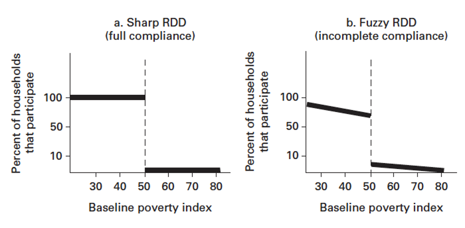
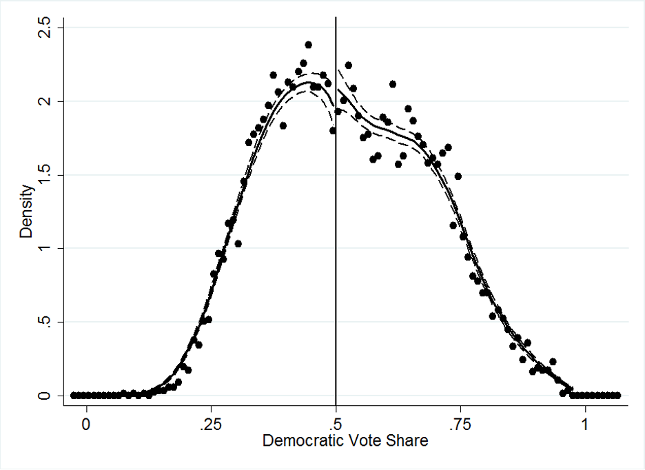

As mentioned in the previous blogs, the most reliable way of examining the causal effect is through running random trials. However, it is not always feasible to run these experiments in the real world either due to ethical concerns or lack of funding. So, we need to use some “tricks” to overcome the endogeneity issue in the set-up and obtain the causal estimate with best data available. Regression Discontinuity Design (RDD) is one of such tricks. 

---
### What is RDD?
*Regression Discontinuity Design (RDD)* is one of the quasi-experimental impact evaluation methods which measures the treatment effect at the cutoff point. Thistle and Campbell first applied RDD to evaluate the effect of a scholarship program in 1960[^scholarship]. The research question is to understand the impact of receiving scholarships on students’ future grades. 

From our earlier discussions, we know that only comparing the grades for students with and without scholarships will lead to biased estimation due to self-selection issue. In other words, students in the treatment group could have much higher scores in the past than those other students without the scholarship. It could be the generic differences between students in these two groups that affect the students’ future grades rather than receiving the scholarship. However, if we only look at students at the cutoff grade (a score of 80), we can assume students who almost got the scholarship (i.e., students with a score of 79.5) and students barely got the scholarship (i.e., students with a score of 80.5) have very similar past academic performance. And we can use them to estimate the impact of receiving a scholarship.

---

### Features and Assumptions

In RDD, there is a continuous variable `$X_i$` on which determines the treatment group, denoted by `$D_i$` (1 if treated). This continuous variable `$X$` is called the running variable, the assignment variable, or the forcing variable. We also must know a clearly defined the cutoff point or threshold, `$c$`.

The assignment of treatment can be either *deterministic* or *probabilistic*. 

+ If *deterministic*, this is a **sharp RDD**. A unit is treated if `$X_i$`≥`$c$` and not treated if `$X_i$`<`$c$`. The running variable completely determines who gets treatment so that the probability of treatment changes from 0 to 1 at the cutoff.

+ If *probabilistic*, this is a **fuzzy RDD**. `$D$` is considered as a random variable given `$X$`, but `$E[D_i |X_i=c]$` is known to be discontinuous at `$c$`. So, the probability of treatment is discontinuous at the cutoff, `$E[D_i│X_i=c]=Pra[D_i=1│X_i=c]$`, rather than to the degree of a definitive 0 to 1 jump. If it is a fuzzy RDD design, the idea is behind is very similar to an instrumental variable approach. The instrument `$Z$` acts like a pseudo “randomizer” in the sense that `$Z$`  is a strong predictor of treatment but it must be conditional independent of the outcome.

**
Figure illustration of Sharp RDD vs. Fuzzy RDD[^rdd]
**

One assumption of RDD is that it requires the continuity of `$X$` for identification, because identification is at the limit (however, in practice some RDD studies have used discrete running variables):

*Estimate of treatment effects:* 
$$\lim_{c \to x}E[Y_i|X_i=x]-\lim_{x \to c}E[Y_i|X_i=x]$$
*Equivalent to:*
$$\lim_{c \to x}E[Y_i|X_i=x, D_i=1]-\lim_{x \to c}E[Y_i|X_i=x, D_i=0]$$
*We know everyone gets treatment above cutoff and nobody does below cutoff. So,*
$$\lim_{c \to x}E[Y_i|X_i=x]\approx E[Y_{1i}|X_i=c]$$
*and*
$$\lim_{x \to c}E[Y_i|X_i=x]\approx E[Y_{0i}|X_i=c]$$

The most import assumption of RDD is so-called **no-manipulation-with-precision** assumption. The identification of treatment effects is based on `$X$` being like a “randomizer” around `$c$`, which means the treatment assignment is “as good as random” at the threshold[^random]. If `$c$` is not arbitrary or has a deterministic relationship to `$Y$` or if units could determine `$X$` and thus choose treatment assignment, then `$X$` around `$c$` is not randomized. In this case, self-selection could be induced that depend on unobservables. For instance, in the scholarship example, students must not be able to manipulate their score to determine their treatment status accordingly, i.e., by convincing teachers to “mercy pass” them or allow them to retake the exam so they can pass the threshold score. This brings in some form of self-selection.

---

### Estimation

Now we should notice one key issue with estimation in sharp RDD is that we have complete lack of overlap. Overlap would require `$0<Pra(D_i=1│X_i)<1$` for the domain of `$X_i$`. In the domain of running variable with sharp RDD, this requirement is not satisfied, where  `$Pr(D_i=1│X_i<c)=0$` and `$Pr(D_i=1│X_i\ge c)=1$`. Therefore, we would require extrapolation to estimate treatment effects, and thus the model specification is a key issue in RDD estimation. If we get the functional form `$Y_i=f(X_i)$` wrong, we won’t be able to estimate correctly. 

*Parametric Methods*

We assume linear relationship between `$Y$` and `$X$`,
$$Y_i=β_0+β_1 D_i+β_2 X_i+ε_i$$

Where:

`$Y_i$` is the outcome of interest of individual i,

`$D_i$` is an indicator function that takes the value of 1 for individuals assigned to the treatment `$D_i=1\    (X_i≥c)$` and `$0$` otherwise,

It is standard to center the running variable at the cutoff point:
$$Y_i=β_0+β_1 D_i+β_2 (X_i-c)+ε_i$$

So, we have:
$$E[Y_i |D_i=1,X_i=c]=β_0+β_1$$, and
$$E[Y_i |D_i=0,X_i=c]=β_0$$

$$E[Y_i│D_i=1,X_i=c]-E[Y_i│D_i=0,X_i=c]=β_1$$

In the above model specification, we don’t include any interaction between `$X$` and `$D$`, which means the effect of `$D$` does not depend on the value of `$X$`. And therefore, `$β_1$` is consistent and remains the same. Now if we add an interaction, the model specification becomes:
$$Y_i=α_0+α_1 D_i+α_2 (X_i-c)+α_3 (X_i-c)×D_i+η_i$$

`$α_1$` is the treatment effect at `$X_i=c$`, and if `$α_3≠0$`, then the treatment effect at some other point would be different. But we care about the treatment effect at the discontinuity. 

To simplify the notation, we let `$\hat{X} ≡(X-c)$`, and the model now becomes:
$$Y_i=α_0+α_1 D_i+α_2\hat{X}_i+α_3\hat{X}_i×D_i+η_i$$

We can then add a quadratic term to relax the linear assumption at the first place:
$$Y_i=α_0+α_1 D_i+α_2\hat{X}_i+α_3\hat{X}_i×D_i+γZ_i+η_i$$

It’s also possible to extend the model to accommodate treatment heterogeneity by interacting `$D$` with one of the variables in `$Z$`.

We should conduct test to ensure that there is no discontinuity on the covariates. In other words, we can do the same RDD analysis for each of the continuous baseline covariates to verify that they are not discontinuous at the cutoff point. Because if a discontinuity in a covariate is observed, this might imply that the discontinuity in the outcome is due to a discontinuity in a confounder rather than a true treatment effect.

*Nonparametric Methods*

Another way of estimating treatment effects with RDD is through non-parametric methods, where we don’t make assumptions about the shape of `$f(X_i)$`. I wouldn’t dive too much into the discussion of nonparametric methods in this post. But one thing good to know is that we would need to make decisions about the kernel function, which requires theis used to selection of optimal bandwidth size and the specifications. 

---

### Interpretation

In RDD, treatment effects are local average treatment effects at the cutoff point, called **LATE**. Back to the assumption, the units to the left and right of the cutoff look very similar so they lay the groundwork for a comparison. And therefore, the estimate does not necessarily apply to units further away from the cutoff point. 

+ If the evaluation interest is to determine whether a program should exist or not, then the average treatment effect for the entire eligible population would be the most relevant parameter in this case. And RDD wouldn’t provide a sufficient answer to the question.

+ If the research question is whether a program should be cut or expanded at the margin, then the RDD would be the best option to inform this decision, as it precisely produces the local estimate of interest.

---

### Testing the Assumptions

It is very important to conduct tests to validate the assumptions when using RDD. The intent is to ensure that the causal impact of an intervention is caused by the assignment rules rather than anything else. 

##### 1)	Density test
The density test is used to rule out the possibility of data manipulation. We can plot the distribution of running variable: if we observe a discontinuity around the cutoff point, this may suggest that some units were able to manipulate their treatment status. 

**
Example of Density Test[^density]
**

##### 2) Continuity of observable variables
We need to examine if the units were just barely treated and the units who were barely not are similarly based on observable variables. 

##### 3)	Some other placebo tests 
Some other placebo tests such as testing predetermined variables, other discontinuities, inclusion and exclusion of covariates, etc

 
---

Useful References:

1. https://donskerclass.github.io/EconometricsII/RegressionDiscontinuity.html
2. https://dimewiki.worldbank.org/Regression_Discontinuity
3. https://clas.ucdenver.edu/marcelo-perraillon/sites/default/files/attached-files/week_10_rdd_perraillon.pdf
4. https://en.wikipedia.org/wiki/Regression_discontinuity_design#cite_note-McCrary_2008-12

[^scholarship]: Thistlethwaite, D. L., & Campbell, D. T. (1960). Regression-discontinuity analysis: An alternative to the ex post facto experiment. Journal of Educational Psychology, 51(6), 309–317. https://doi.org/10.1037/h0044319
[^rdd]: Figure illustration of Sharp RDD vs. Fuzzy RDD from: https://dimewiki.worldbank.org/Regression_Discontinuity
[^random]: Regression discontinuity design. https://en.wikipedia.org/wiki/Regression_discontinuity_design
[^density]: Example of density test. https://en.wikipedia.org/wiki/Regression_discontinuity_design#/media/File:McCrary_(2008)_Density_Test_on_Data_from_Lee,_Moretti,_and_Butler_(2004).png
