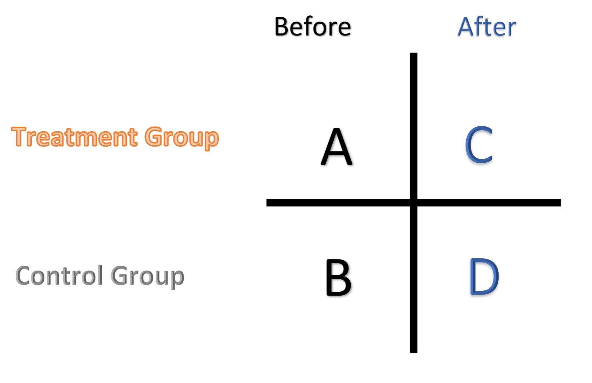
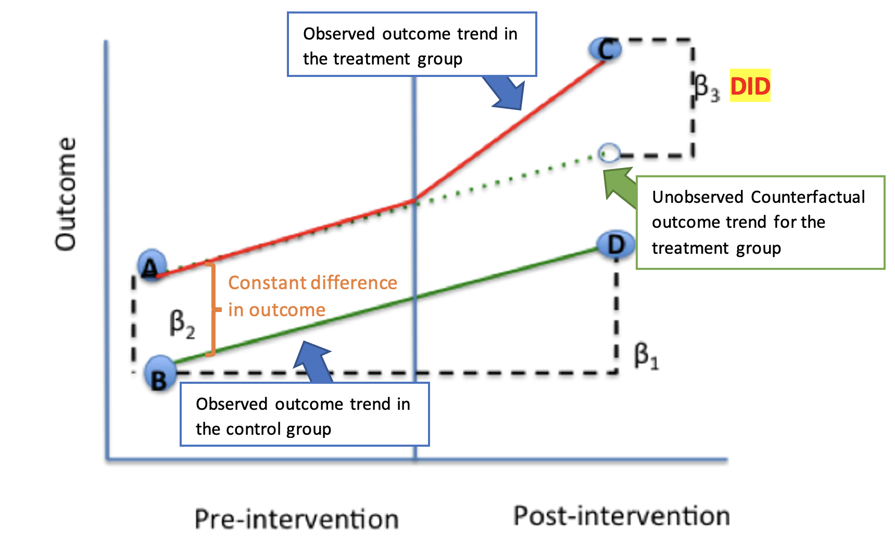

**The difference in differences (DID)** method is a statistical technique or quasi-experimental design method used extensively in econometrics and social sciences. It calculates the treatment effect by *comparing the difference between treatment and control group after the treatment relative to the same difference before the treatment*. As discussed earlier in our Randomized Controlled Trials post, we cannot simply draw causal conclusions by directly observing before-and-after changes in outcomes, because factors other than the treatment may influence the outcome over time. We cannot simply compare between treatment and control groups due to differences from selection bias and other unobserved characteristics between the groups[^did]. DID is intended to eliminate the effects from such confounding factors, and therefore can estimate a causal effect. 

---
### Implementation

##### *Four Numbers*

DID only requires four numbers – outcomes from the treatment group and the control group, both before and after the treatment.

Compute the difference-in-differences as follows:

1.	Calculate the before-after difference in the outcome (Y) for the treatment group, `$C-A$`.
2.	Calculate the before-after difference in the outcome (Y) for the control group, `$D-B$`.
3.	Calculate the difference between the difference from step 1 and the difference from step 2, which is the difference-in-differences: `$DID=(C-A)-(D-B)$`.

##### *Model Specification*

DID is usually implemented as an interaction term between time and treatment group dummy variables in the regression model.

$$
Y_{it}=β_0+β_1×Post_t+β_2×Treat_i+ β_3×(Post_t×Treat_i )+β_4×X_{it}+ ε_{it}
$$

Below is the figure[^didregress] that explains the meaning of coefficients:

+ `$β_0$` represents for the baseline average, `$B$`.
+ `$β_1$` represents for the time trend in control group, `$D-B$`.
+ `$β_2$` represents for the difference between group before the intervention, `$A-B$`.
+ `$β_3$` represents for the difference in changes over time, `$(C-A)-(D-B)$`.

---
### Parallel Trends Assumption

The parallel trends assumption is required by the DID approach, which ensures no time-varying differences between the treatment and control groups. This means in the absence of treatment, the difference between the treatment and control groups remains the same over time, which are the two parallel lines shown in the figure above. Violation of the parallel trends assumption will lead to a biased estimation of the causal effect. A more rigorous test of the parallel trends assumption will be explained in the set up of event study, which will be introduced in the next post.

---
### Two-way Fixed Effects

A more flexible form of the DID approach is to include a series of dummy variables for entity and time periods. The specification is as follows

$$
Y_{it}=α_0+\sum_{i=1}^{n-1} β_iEntity_i+\sum_{t=1}^{m-1} γ_t Time_t+ δ_{DD} (Treat_i×Post_t)+ωX_{it}+ ε_{it}
$$

The summations of these dummy variables are also called entity fixed effect (FE) and time FE. The model is also called two-way fixed effect model. 

 
---

Useful References:

1. https://www.publichealth.columbia.edu/research/population-health-methods/difference-difference-estimation
2. https://dimewiki.worldbank.org/Difference-in-Differences#:~:text=The%20difference%2Din%2Ddifferences%20method,useful%20tool%20for%20data%20analysis.
3. https://www.statisticshowto.com/difference-in-differences/
4. https://theeffectbook.net/ch-DifferenceinDifference.html

[^did]: Difference-in-Differences. The World Bank. https://dimewiki.worldbank.org/Difference-in-Differences#:~:text=The%20difference%2Din%2Ddifferences%20method,useful%20tool%20for%20data%20analysis.
[^didregress]: Modified based on the figure provided in "Difference-in-Difference Estimation" by Columbia Public Health. https://www.publichealth.columbia.edu/research/population-health-methods/difference-difference-estimation