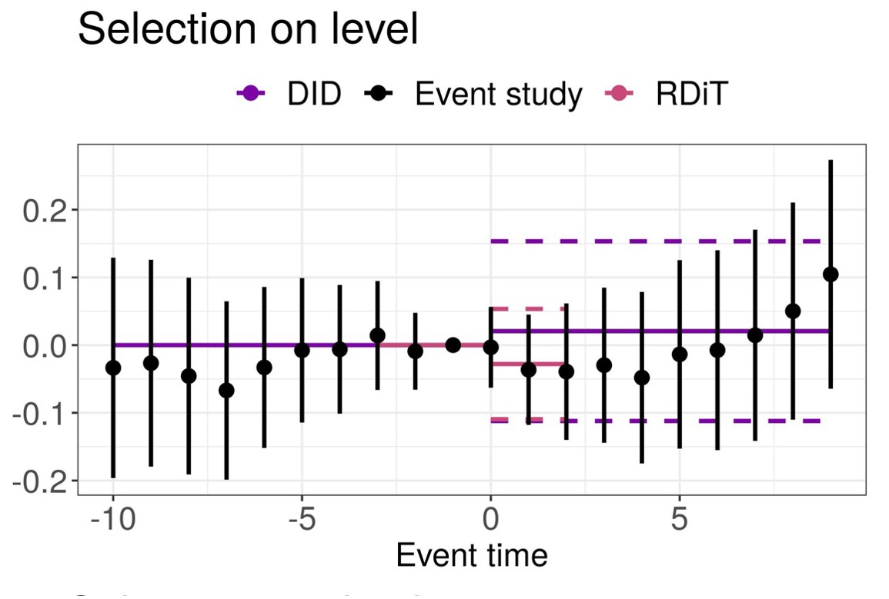
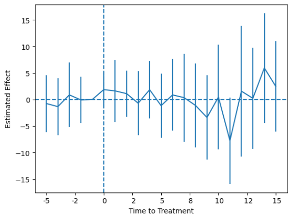

In our last post, we introduced the Difference in Differences (DID) approach. And in this post, we will extend the use of DID and talk about the **Dynamic DID** model, which is also referred as **Event Study**. 

As we discussed, the DID design estimates the causal effects by comparing the difference between treatment and control group from the post-treatment period (after) relative to the difference from the pre-treatment period (before): *The Dynamic DID is used when the treatment group are treated at different time periods, and therefore is a staggered treatment design*.

---

### What does event study look like?

An event study is a graphical illustration of the point estimates and their confidence intervals from a regression for each time before and after the treatment period. 

The figure below is an event study example from a [blog](https://blogs.worldbank.org/impactevaluations/econometrics-sandbox-event-study-designs-co) posted by World Bank[^example].

Each point estimate is the mean difference between the treated group and control group each year comparing to the same difference in the reference year. And thus, we can clearly see the post treatment impact in each year after the policy shock. This is a useful tool if you are interested in investigating the short-run versus long-run impact of a policy, given that the event study plot can capture the dynamic treatment effect of each year. 

---
### Model Specification

The regression of an event study is:

$$
Y_{it} = α_0 + \sum_{τ=2}^{T_1} β_{+τ} × D_{i,t+τ} + \sum_{τ=0}^{T_2} β_{-τ} × D_{i,t-τ} + \tilde{D_{it}}' γ + X_{it}' δ + ϕ_i + ω_t + ε_{it}
$$

This is a leave-one-out specification, where one of the time periods is dropped to avoid multicollinearity. In most cases, the -1 time period is dropped and regarded as the reference year.

+ `$α_0$` is the constant
+ `$D_{i,t+τ}$` is the dummy variable, equaling 1 if the observation’s period is `$τ$` period away from the treatment period. `$+$` represents for the lead periods. Same as `$D_{i,t-τ}$`, while `$-$` represents for the lag periods
+ `$\tilde{D_{it}}'$` is used when it is necessary to bin up any leads or lags that are far away from the treatment year – This is the end-point restriction
+ `$X_{it}'$` are other controls
+ `$ϕ_i$` and `$ω_t$` are entity and time fixed effects
+ `$ε_{it}$` is the error term, and estimation is generally performed with standard errors clustered at the group level

---
### Implementation Example

The implementation example is from a [blog](https://lost-stats.github.io/Model_Estimation/Research_Design/event_study.html) posted by the Library of Statistical Techniques (LOST)[^implement]. The original data comes from [Stevenson and Wolfers (2006)](http://users.nber.org/~jwolfers/papers/bargaining_in_the_shadow_of_the_law.pdf) and [Clark & Schythe (2020)](https://docs.iza.org/dp13524.pdf) use it to demonstrate Goodman-Bacon effects. I will not expand the discussion of the Goodman-Bacon decomposition here, where there is a fast-growing literature on the new DID estimation with different weighting. I will, instead, leverage this dataset to showcase an event study plot.

This dataset is a balanced panel from 1964 through 1996 of the United States no-fault divorce reforms and female suicide rates. Please see the detailed description of the database in this LOST’s blog page. And they also shared the implementation of event study in Python, R and Stata.

The figure is from my implementation in Python. The x-axis is the relative treatment time, where the reform treatment turned on in period zero. The y-axis is the difference in female suicide rates between treatment and control group. The plot includes 5 leads and 15 lags, and any leads and lags that are far-away are binned up in the `$\tilde{D_{it}}'$` term and not plotted. An “ideal” event study would be having the coefficients from the lead periods close to zero, with coefficients deviating from zero in the lag periods. This would illustrate that the parallel trend assumption is satisfied, meanwhile, the policy introduces a significant effect post treatment.

Compared to the traditional DID design, an event study provides a rigorous way to test for the parallel trend assumption and is able to show the treatment effect at different time periods.

[^example]:Florence Kondylis & John Loeser. Econometrics Sandbox: Event Study Designs & Co. https://blogs.worldbank.org/impactevaluations/econometrics-sandbox-event-study-designs-co
[^implement]: Difference-in-Differences Event Study / Dynamic Difference-in-Differences. https://lost-stats.github.io/Model_Estimation/Research_Design/event_study.html
