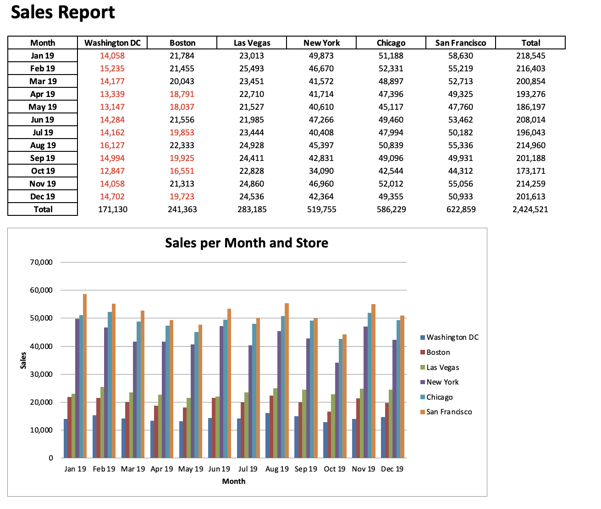

Recently I've been reading this book ["Python for Excel: A modern Environment for Automation and Data Analysis (2021)"](https://www.oreilly.com/library/view/python-for-excel/9781492080992/)[^summary], and was impressed by the easiness of reader and writer packages available in python! This post borrows the content from the Chapter 8 of this book, Excel File Manipulation with Reader and Writer Packages, where ***OpenPyXL*** and ***XlsxWriter*** packages will be introduced. Both packages cover similar functionality of writing *xlsx* or *xlsm* files, but each package has its own few features that are unique to the other. 

🗒️**OpenPyXL** can read, write, and edit, as well as make it easier to produce Excel files with VBA macros.

🗒️**XlsxWriter** can only write but is better documented. It tends to run faster than OpenPyXL, although the performance depends on the size of the workbook you're writing. The differences therefore may not be significant!

---

### OpenPyXL
#### It can both read and write Excel files!
#### Reading with OpenPyXL
To get the cell values, the workbook should be opened with `data_only=True`. Otherwise, the default is on `False`, which would return the formulas rather than the cell values.

```
import openpyxl

book = openpyxl.load_workbook("xl/stores.xlsx", data_only=True)

print(book.sheetnames)
# Loop through the sheet objects.
# Instead of "name", openpyxl uses "title"
for i in book.worksheets:
  print(i.title)

# Get a worksheet object by name or index (0-based)
sheet = book["2019"]
sheet = book.worksheets[0]
print(sheet.max_row, sheet.max_column)

# using "A1" notation and using cell indices (1-based)
print(sheet["B6"].value)
print(sheet.cell(row=6, column=2).value)
```

#### Writing with OpenPyXL
OpenPyXL builds the Excel file in memory and writes out the file once you call the `save` method. It can not only fill in the cell values but also apply the formatting options to the Excel file. These are the mostly used methods from OpenPyXL:
```
import openpyxl
from openpyxl.drawing.image import Image
from openpyxl.chart import BarChart, Reference 
from openpyxl.styles import Font, colors
from openpyxl.styles.borders import Border, Side 
from openpyxl.styles.alignment import Alignment 
from openpyxl.styles.fills import PatternFill
```

##### 1. Instantiate a workbook and write cells
```
book = openpyxl.Workbook()
sheet = book.active
sheet.title = "Sheet1"
sheet["A1"].value = "Hello 1"
sheet.cell(row=2, column=1, value="Hello 2")
```

##### 2. Formatting
```
# fill color, alignment, border and font
font_format = Font(color="FF0000", bold=True)
thin = Side(border_style="thin", color="FF0000")
sheet["A3"].value = "Hello 3"
sheet["A3"].font = font_format
sheet["A3"].border = Border(top=thin, left=thin,
                            right=thin, bottom=thin)
sheet["A3"].alignment = Alignment(horizontal="center")
sheet["A3"].fill = PatternFill(fgColor="FFFF00", fill_type="solid")

# Number formatting
sheet["A4"].value = 3.3333
sheet["A4"].number_format = "0.00"

# Date formatting
import datetime as dt
sheet["A5"].value = dt.date(2016, 10, 13)
sheet["A5"].number_format = "mm/dd/yy"
```

##### 3. Formula
```
sheet["A6"].value = "=SUM(A4, 2)"
```

##### 4. Image
```
sheet.add_image(Image("images/python.png"), "C1")
```

##### 5. Chart
```
chart = BarChart()
chart.type = "col"
chart.title = "Sales Per Region"
chart.x_axis.title = "Regions"
chart.y_axis.title = "Sales"
chart_data = Reference(sheet, min_row=11, min_col=1,
                       max_row=12, max_col=3)
chart_categories = Reference(sheet, min_row=10, 
                             min_col=2, max_row=10,   
                             max_col=3)

chart.add_data(chart_data, titles_from_data=True, from_rows=True)
chart.set_categories(chart_categories)
 sheet.add_chart(chart, "A15")
```

The last step is to save the workbook to create the file on disk, `book.save("openpyxl.xlsx")`. If you want to create an Excel template file, you'll have to set the `template` attribute to `True` before saving:
```
book.template = True
book.save("template.xltx")
```
---
### XlsxWriter
#### Note that **XlsxWriter** uses zero-based cell indices, while **OpenPyXL** uses one-based cell indices!

#### Writing with XlsxWriter
Let's reproduce the same workbook as we previously created with OpenPyXL.

```
import datetime as dt 
import xlsxwriter

book = xlsxwriter.Workbook("xlxswriter.xlsx")
sheet = book.add_worksheet("Sheet1")

sheet.write("A1", "Hello 1")
sheet.write(1, 0, "Hello 2")

formatting = book.add_format({"font_color": "#FF0000",
                              "bg_color": "#FFFF00",
                              "bold": True, "align": "center",
                              "border": 1, "border_color": "#FF0000"})
sheet.write("A3", "Hello 3", formatting)

number_format = book.add_format({"num_format": "0.00"})
sheet.write("A4", 3.3333, number_format)

date_format = book.add_format({"num_format": "mm/dd/yy"})
sheet.write("A5", dt.date(2016, 10, 13), date_format)

sheet.write("A6", "=SUM(A4, 2)")

sheet.insert_image(0, 2, "images/python.png")

chart = book.add_chart({"type": "column"}) chart.set_title({"name": "Sales per Region"}) chart.add_series({"name": "=Sheet1!A11",
                  "categories": "=Sheet1!B10:C10",
                  "values": "=Sheet1!B11:C11"})
chart.add_series({"name": "=Sheet1!A12",
                  "categories": "=Sheet1!B10:C10",
                  "values": "=Sheet1!B12:C12"})
chart.set_x_axis({"name": "Regions"})
chart.set_y_axis({"name": "Sales"})
sheet.insert_chart("A15", chart)

book.close()
```

### Excel Reporting Case Study
This case study resembles a real-life application of processing monthly Excel files into an Excel report. You can find the original datasets and jupyter notebooks [here](https://github.com/wzhu816/python-for-excel-practice/tree/main/Excel%20File%20Manipulation%20Case). In the `/sales_data` folder, you will find Excel files with fake sales trasactions from a telecommunication provider selling plans (Bronze, Silver, Gold) in a few stores throughout the United States. For every month, there are two files, one in the *new* subfolder for new contracts and one in the *existing* subfolder for existing customers. Note the difference in the formats for the *new* files and *existing* files: the *new* files are delivered as *xlsx* files, while the existing files are with the older *xls* format extension. 

##### Each of the Excel files has up to 10,000 trasanction records, and our goal is to produce a report that shows the total sales per store and month.

As a preparation for the reporting, we'll first need to process the original datasets and transform them into a complete dataset with total sales from each store by month. We can then write them out to an Excel reporting file, and create formatted table and figure accordingly by using either OpenPyXL or XlsxWriter as previously described. The attached graph below is the snapshot of how it will look like in the final Excel reporting file.



If you're interested in the scripts, just download the jupyter notebooks from [this github repository](https://github.com/wzhu816/python-for-excel-practice/tree/main/Excel%20File%20Manipulation%20Case). I also created a [project](/project/python-automatic-reporting/) page to showcase my practice with this case study with some explanations step-by-step. 


[^summary]: Felix Zumstein 2021. *Python for Excel*, O'Reilly Media, Inc.


