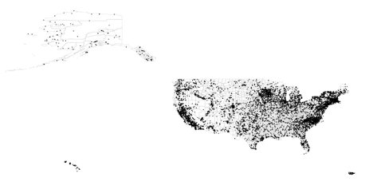
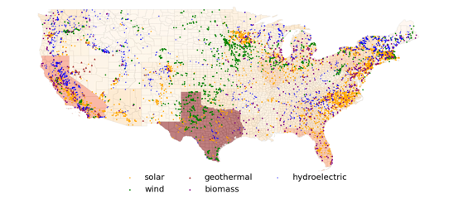
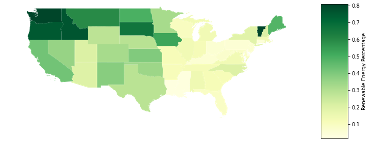

The purpose of this analysis is to examine the distribution of power plants and primary sources of power generation in the United States. The original dataset was downloaded from the U.S. Energy Information Administration (EIA.gov)[^dataset].

The dataset includes all the operable electric generating plants with a combined nameplate capacity of 1 megawatt or more that are operating, are on standby, or are temporarily or permanently out of service (shown as *Figure 1*). 

+ Top five states with the highest installed nameplate MW are: Texas, California, Florida, Pennsylvania, and Illinois.
+ Bottom five states with the least installed MW are: District of Columbia, Vermont, Rhode Island, Alaska, and Hawaii.
+ Highly populated states tend to have high installed nameplate MW.

###### Figure 1 – Visualization of power plants in the U.S. 

---
There are five major types of renewable energy, which are [^renewable]:

🌞 Solar energy from the sun, 

♨️ Geothermal energy from heat inside the earth,

🌬 Wind energy,

🌽 Biomass from plants,

🌊 Hydropower from flowing water,

*Figure 2* displays the locations of power plants in the continental United States that use the renewable energy sources. 

+	Solar power plants are mostly based in coastal states such as California, Arizona, and Florida, where there is an abundance of sunshine.
+	Wind plants are primarily located in the Great Plains region of the U.S. and along the Eastern seaboard, where there is a consistent wind resource.
+	Geothermal power plants are generally built in the western states such as California, Nevada, and Utah because they require water or steam at high temperatures. These states are rich in geothermal reservoirs, which makes them ideal for geothermal power generation.

By examining the locations of these renewable energy plants, we can gain insights into the geographic distribution of renewable energy resources in the U.S. and understand how they are being utilized.

###### Figure 2 – Renewable energy power plants in the U.S. Domestic

---
The color scale in the *Figure 3* represents the percentages of installed MW from renewable sources in the U.S. Domestic. It is important to note that this data only reflects the installed capacity of renewable energy resources and does not necessarily indicate the actual generation of renewable electricity. This is because some power plants might be on standby, or are temporarily or permanently out of service, which would impact the actual share of renewables in the electricity generation. 

###### Figure 3 – Renewable Energy's Share of Installed MW in the U.S. Domestic

[^dataset]: Power Plants. Updated on February 9, 2023. The U.S. Energy Information Administration (EIA.gov). Accessed from: https://atlas.eia.gov/datasets/eia::power-plants/explore?location=33.337154%2C-118.496000%2C3.55
[^renewable]: What is energy? The U.S. Energy Information Administration (EIA.gov). Accessed from: https://www.eia.gov/energyexplained/what-is-energy/sources-of-energy.php#:~:text=The%20major%20types%20or%20sources,Wind%20energy
