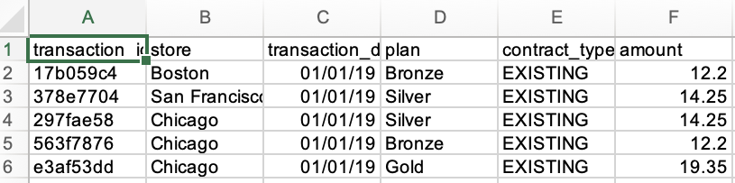
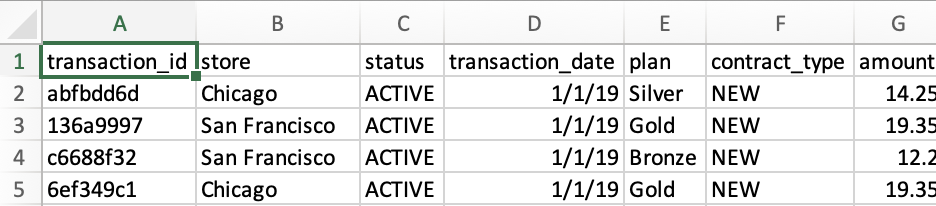
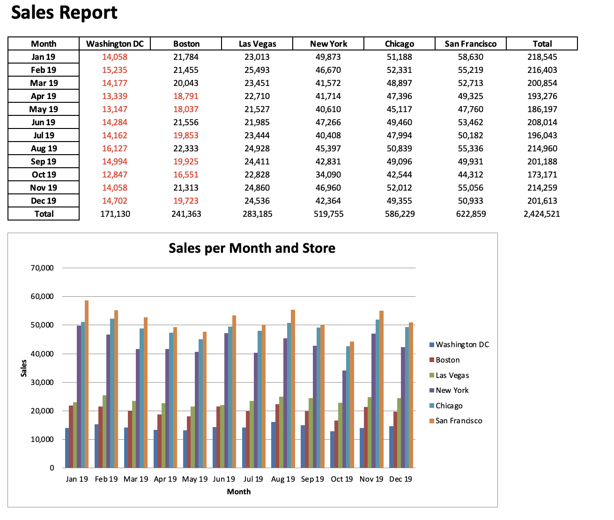

My previous project introduces how to create reproducible Word document and Excel file with Stata. This project focuses on processing raw Excel files and creating an Excel reporting file with python packages. Python has many writer packages, but I'll use *OpenPyXL* and *XlsxWriter*. If you're not familiar with these two packages, plese feel free to check out the introduction [blog](/blog/excel-reporting-writer/) I wrote.

## Original Data
You can find the original datasets in this github [repository](https://github.com/wzhu816/python-for-excel-practice/tree/main/Excel%20File%20Manipulation%20Case). In the `/sales_data` folder, you will find Excel files with fake sales trasactions from a telecommunication provider selling plans (Bronze, Silver, Gold) in a few stores throughout the United States. For every month, there are two files, one in the `new` subfolder for new contracts and one in the `existing` subfolder for existing customers. Note the difference in the formats for the new files and existing files: the new files are delivered as `xlsx` files, while the existing files are with the older `xls` format extension. Each of the Excel files has up to 10,000 transaction records.

**Figure 1 - Snapshot of *existing* file (.xls)** 


**Figure 2 - Snapshot of *new* file (.xlsx)** 


## Transform Data
Use `pandas` package to append monthly datasets and pivot each store into a column and sum up all transactions by month.

If you write in a code editor such as VS Code, you can get the directory of your file this way:
```
from pathlib import Path 
this_dir = Path(__file__).resolve().parent
```
If you write in jupyter notebook, you can write like this:
```
import os
this_dir = os.getcwd()
```
**1. Read in all files**
```
import pandas as pd

parts = []

for file in Path(this_dir).rglob('*.xls*') :
    print(f'Reading {file.name}')
    part = pd.read_excel(file)
    parts.append(part)
```
We use *rglob* method of the path object to read in all Excel files recursively from within a certain directory. *glob* is short for *globbing*, which refers to pathname expansion using wildcards. The *r* in *rglob* stands for *recursive* globbing, so it will look for matching files across all subdirectories.

**2. Concate the DataFrames and pivot data**
```
df = pd.concat(parts)

pivot = pd.pivot_table(df, 
                       index="transaction_date", columns="store",
                       values="amount", aggfunc="sum")

summary = pivot.resample("M").sum()
summary.index.name = "Month"
```
By this step, we've pivoted each store into a column and derived summed transactions by the end of month. We'll further sort the stores by total revenue and give it row and column totals.

```
summary = summary.loc[:, summary.sum().sort_values().index]

summary.loc[:, "Total"] = summary.sum(axis=1)
summary.loc['Total'] = summary.sum()
```

### Write Summary Report to Excel File
We can use either **OpenPyXL** or **XlsxWriter** to write the data out to an Excel file. I have written a [blog](/blog/excel-reporting-writer/) to introduce how to use the methods from these two packages to write values into cells and create desired formatting. You can assign the engine to your selected writer package when use `pd.ExcelWrite`. For example,
```
with pd.ExcelWriter(Path(this_dir)/"sales_report_openpyxl.xlsx",
                   engine="openpyxl") as writer: 
  summary.to_excel(writer, sheet_name="Sheet1",
                   startrow=startrow-1, startcol=startcol-1)
```
Or, if you want to use *XlsxWriter*,
```
with pd.ExcelWriter(Path(this_dir)/"sales_report_xlsxwriter.xlsx",
                   engine="xlsxwriter", datetime_format="mmm yy") 
                   as writer:    
    summary.to_excel(writer, sheet_name="Sheet1",
                    startrow=startrow, startcol=startcol)
```

You can use your selected package to add DataFrame to the Excel file and format it into a table. And you can also create a barchart to show how the transactions from these stores compare to each other month-by-month. The final product looks like this:

**Figure 3 - Snapshot of final reporting file** 


This is a case study provided in the "Chapter 8 Excel File Manipulation with Reader and Writer Packages" from this book ["Python for Excel: A modern Environment for Automation and Data Analysis (2021)"](https://www.oreilly.com/library/view/python-for-excel/9781492080992/). Provided is the [link](https://github.com/fzumstein/python-for-excel) to the companion repo of this book on github <i class="fab fa-github pr-1 fa-fw"></i>.